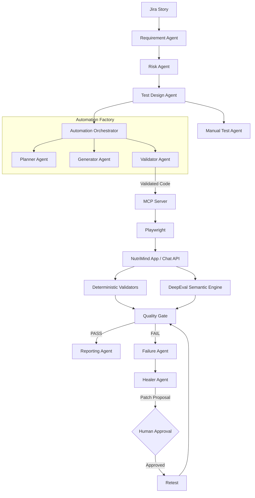

# NutriMind AI — Agentic Quality Engineering Framework for GenAI Applications

[](https://github.com/vinithaGaddamedi/NutriMind-AI/actions)
[](https://opensource.org/licenses/MIT)

## 2. Executive Summary
NutriMind AI is an enterprise-grade demonstration of **Agentic Quality Engineering (QE)**. It showcases a modern Shift-Left QA architecture where autonomous AI agents collaborate to ingest Jira requirements, plan test scenarios, generate Playwright automation, validate code coverage, execute end-to-end (E2E) tests via Model Context Protocol (MCP), and autonomously heal broken locators—all gated by strict deterministic business rules and semantic DeepEval scoring.

This framework is built to demonstrate the capabilities required for a **Lead QA Engineer** in the GenAI era: transitioning from writing manual test scripts to architecting and orchestrating autonomous quality pipelines with a "Human-in-the-Loop" governance model.

## 3. Business Application Capabilities
The underlying System Under Test (SUT) is a FastAPI/React web application offering intelligent dietary planning:
- Multi-turn conversational Chatbot for meal recommendations.
- Strict constraint enforcement (e.g., Peanut Allergies, Vegan/Vegetarian diets).
- Dynamic calorie targeting and nutritional profiling.
- Function-calling capabilities interfacing with a user's Pantry inventory and dietary preferences.

## 4. AI-Driven Shift-Left SDLC
The framework operates as a seamless continuous integration loop:

`Jira Story`
→ `Requirement Agent`
→ `Risk Agent`
→ `Test Design Agent`
→ `Manual Test Agent`
→ `Automation Orchestrator`
→ `Planner`
→ `Generator`
→ `Validator`
→ `MCP`
→ `Playwright`
→ `Application`
→ `Deterministic Validators + DeepEval`
→ `Quality Gate`
→ `Failure Agent`
→ `Healer`
→ `Retest`
→ `Reporting`
→ `CI/CD`

## 5. Mermaid Architecture Diagram



## 6. Agent Responsibility Table

| Agent | Responsibility | Key Difference / Distinction |
|-------|----------------|------------------------------|
| **Requirement Agent** | Parses Jira stories into structured JSON acceptance criteria. | Focuses purely on product expectations. |
| **Test Design Agent** | Generates english-language test scenarios. | Operates in human language ("Verify allergy"), whereas the **Planner** operates on the DOM ("Locate data-testid=allergy"). |
| **Planner Agent** | Decides *how* Playwright will execute the test scenario. | Output is a JSON sequence of actions, not code. |
| **Generator Agent** | Writes the actual Python/Playwright syntax. | Does not hallucinate architecture; simply translates the **Planner**'s exact plan into a Pytest script. |
| **Validator Agent** | Ensures the generated Pytest script fulfills the Jira criteria. | Acts as the Automation Quality Gate. It intercepts bad generated code before execution. |
| **Failure Agent** | Performs Root Cause Analysis (RCA) on failed executions. | Answers "Why it broke" (e.g. timeout, 404). |
| **Healer Agent** | Analyzes the DOM and proposes unified diff patches to fix locators. | Answers "How to fix it" and produces a Git patch, unlike the **Failure Agent**. |

## 7. Playwright + MCP Architecture
We utilize the **Model Context Protocol (MCP)** to provide agents with controlled, sandboxed access to the browser via Playwright. 
- Agents do not have raw shell access.
- They invoke specific tools (`navigate`, `click`, `fill`, `get_dom`) ensuring security and strict isolation between the LLM and the host environment.

## 8. GenAI Chatbot Architecture

```text
Chat UI
  → Chat API
  → Conversation Context (Memory)
  → Gemini 2.5 Flash
  → Controlled Tools (get_pantry, get_user_preferences)
  → Business Services
  → Response
  → Deterministic Validation (Hard Rules)
  → DeepEval (Semantic Checks)
```

## 9. AI Testing Strategy
Testing a GenAI Chatbot requires a hybrid approach:
- **Deterministic Validation**: Fast Python assertions verifying that hard constraints (like "peanut" string absence) are strictly enforced.
- **DeepEval (LLM-as-a-Judge)**: Semantic checks utilizing Gemini to score **Relevance**, **Faithfulness**, **Hallucination**, and **Safety**.
- **Golden Datasets**: Categorized JSON mappings of expected behaviors used to catch regressions in Prompt updates.
- **Advanced Testing**: Includes multi-turn context retention testing (e.g. "I am vegetarian" -> "I am allergic to peanuts" -> "Give me dinner"), tool/function calling verification, and Prompt Injection safeguards.

## 10. AI Governance
**"AI proposes; deterministic systems validate."**

The framework strictly enforces governance:
- DeepEval metrics are never trusted as the sole source of truth for life-threatening constraints (allergies). Deterministic systems govern the final outcome.
- **Human-in-the-Loop**: The `Healer Agent` is restricted from silently committing code to the production branch. All self-healing unified diffs require explicit Human Approval via the CLI/PR.

## 11. Self-Healing Workflow

`Failure`
→ `Failure Agent (RCA)`
→ `Healer (DOM Analysis)`
→ `Patch Proposal (Git Diff)`
→ `Targeted Retest (Dry Run)`
→ `Regression Validation`
→ `Human Approval (Y/N)`

## 12. CI/CD Quality Gates
Our GitHub Actions pipelines (`pr_pipeline.yml`, `nightly_pipeline.yml`) run strict quality gates. The pipeline will instantly `FAIL` if:
- A critical business rule (allergy) is violated in output.
- A Prompt Injection attack succeeds.
- DeepEval Hallucination metrics cross the 5% threshold.

## 13. Project Structure
- `agents/`: The 5-tier autonomous intelligence layer (`orchestration`, `shift_left`, `automation`, `intelligence`, `infrastructure`).
- `automation/`: Playwright scripts, CI/CD utilities, E2E orchestrator, and DeepEval configurations.
- `backend/`: FastAPI application code and Chatbot Logic.
- `.agents/skills/`: Markdown instructions defining the exact guardrails for each agent.
- `docs/`: Deep-dive architectural documentation.

## 14. Getting Started
1. Clone the repository: `git clone https://github.com/vinithaGaddamedi/NutriMind-AI.git`
2. Install dependencies: `pip install -r requirements.txt`
3. Set environment variables (do NOT commit secrets):
   ```bash
   export GEMINI_API_KEY="your_key"
   ```
4. Run the API: `uvicorn backend.main:app --reload`
5. Execute tests: `pytest automation/tests/`

## 15. Interview Demo Scenario
You can execute the entire Agentic QA lifecycle autonomously via:
```bash
python automation/demo_e2e_lifecycle.py
```

**The Scenario:**
> "As a user, I want to generate a vegetarian meal plan that excludes peanuts and stays within a 2000 calorie target."

**The Flow:**
1. The `RequirementAgent` parses the Jira story.
2. The `AutomationOrchestrator` translates it via the `Planner` and `Generator`.
3. The `Validator` approves the code.
4. The script executes against the real application backend.
5. We programmatically inject a defect into the API (ignoring peanut allergies).
6. The test fails; `DeterministicValidator` catches the peanut string.
7. The `FailureAgent` triggers the `HealerAgent`, which proposes a `.patch` file.
8. The console pauses for **Human Approval**.

## 16. Documentation Links
For deep architectural details, see the `docs/` folder:
- [Architecture Gap Analysis](docs/ARCHITECTURE_GAP_ANALYSIS.md)
- [Agent Architecture](docs/agent-architecture.md)
- [AI Testing Strategy](docs/ai-testing-strategy.md)
- [Chatbot Testing](docs/chatbot-testing.md)
- [DeepEval Strategy](docs/deepeval-strategy.md)
- [Self Healing Strategy](docs/self-healing.md)

## 17. Known Limitations
- The UI layer (React) is currently minimal/stubbed; most logic relies on backend API validations.
- DeepEval latency can be high; thus, it runs asynchronously in the CI/CD pipeline rather than blocking real-time local test executions.
- The MCP browser context requires a headed state for advanced DOM healing snapshotting.

## 18. Future Enhancements
- Visual regression testing using multi-modal Gemini.
- Jira API bi-directional sync (creating bugs dynamically upon test failure).
- Distributed Playwright execution for the E2E Agent workflows.
