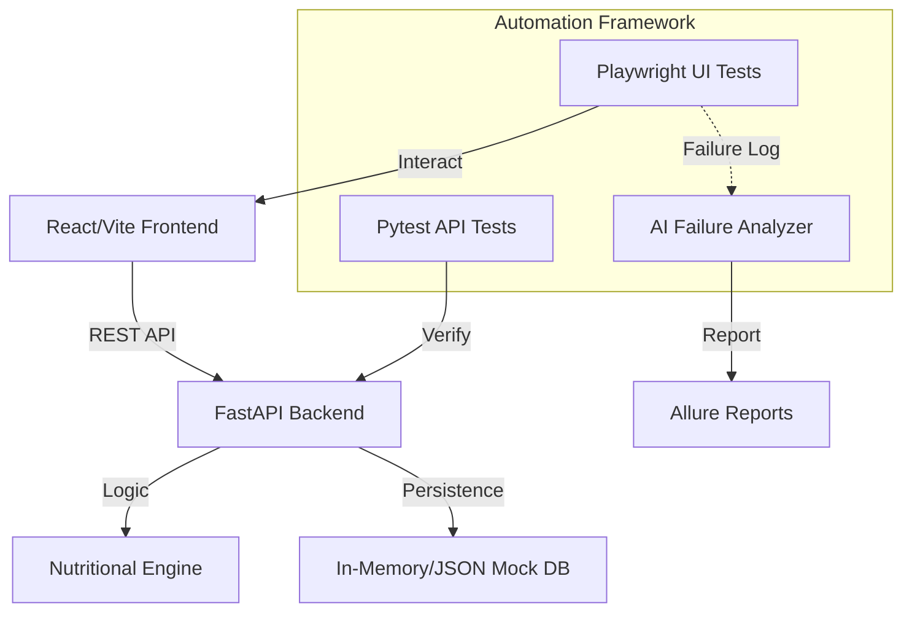

# 🥗 NutriMind AI: Unified Automation & Intelligence Architecture

[](https://github.com/vinithagaddamedi24-spec/NutriMind-AI/actions)
[](https://opensource.org/licenses/MIT)
[](https://playwright.dev/)
[](https://fastapi.tiangolo.com/)

**NutriMind AI** is a state-of-the-art, full-stack demonstration project that integrates AI-driven nutritional planning with a high-maturity **Unified Automation Framework**. Designed for the modern SDET and Test Architect, it showcases how to build, test, and monitor complex distributed systems.

---

## 🚀 Key Features

### 🧠 Intelligence & Experience
- **AI Meal Planner:** Personalized weekly nutritional plans generated via AI logic.
- **Smart Pantry Sync:** Real-time inventory tracking with automated shopping list generation.
- **Modern Shopping Experience:** A sleek, glassmorphism-inspired React UI with dynamic checkout flows.

### 🛠️ Automation Excellence (The "Test Architect" Showcase)
- **Cross-Layer Testing:** Integrated test suites covering **API (FastAPI)**, **Web (Playwright)**, and **Integration** layers.
- **🤖 AI Failure Analysis:** Integrated with LLMs (Llama 3 via Groq) to automatically analyze test failures, providing root-cause analysis and fix suggestions in real-time.
- **Self-Healing Capabilities:** Robust locator strategies and smart waits to minimize flakiness.
- **Professional Reporting:** Comprehensive **Allure Reports** with embedded screenshots, video recordings, and AI-generated insights.
- **CI/CD Integration:** Automated quality gates via GitHub Actions with deployment to GitHub Pages.

---

## 🏗️ Technical Architecture



---

## 🚦 Getting Started

### 1. Prerequisites
- Python 3.11+
- Node.js 18+
- Groq API Key (for AI Analysis)

### 2. Backend Setup
```bash
cd backend
python -m venv .venv
source .venv/bin/activate
pip install -r requirements.txt
uvicorn main:app --reload
```

### 3. Frontend Setup
```bash
cd web-app
npm install
npm run dev
```

### 4. Running Automation
```bash
cd automation
pip install -r requirements.txt
playwright install

# Run all tests with reporting
pytest --alluredir=reports/allure-results
```

---

## 📊 Reporting & Monitoring
- **CI/CD Dashboard:** View execution history in [GitHub Actions](https://github.com/vinithagaddamedi24-spec/NutriMind-AI/actions).
- **Test Insights:** Allure reports are automatically generated and deployed to GitHub Pages on every push to `main`.

---

## ⚖️ License
Distributed under the MIT License. See `LICENSE` for more information.

---
**Developed by [Vinitha Gaddamedi](https://github.com/vinithagaddamedi24-spec)** - *Empowering quality through intelligence.*
