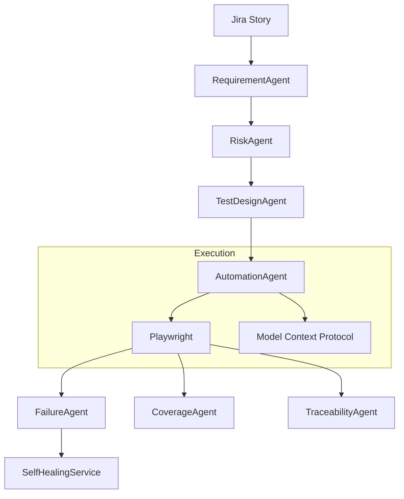

# Agent Architecture

The framework relies on a constellation of specialized, single-responsibility AI agents. 

## Agent Responsibilities

1. **RequirementAgent**: Parses Jira stories, extracts explicit `AcceptanceCriteria`.
2. **RiskAgent**: Analyzes the parsed criteria to identify critical edge cases (e.g. data loss, allergy violations).
3. **TestDesignAgent**: Outputs formal `TestScenario` objects detailing exact execution steps.
4. **AutomationAgent**: Generates Playwright or Pytest code.
5. **FailureAgent**: Categorizes test failures (Locator vs Application) based on stack traces and DOM snapshots.
6. **CoverageAgent / TraceabilityAgent**: Scans the SDLC matrix to ensure every High-Risk requirement is linked to a successfully passing test payload.

## Communication & Schema Validation
Agents communicate **exclusively via Pydantic schema validation**. 
When the `RequirementAgent` finishes, it returns a strictly typed JSON object. The `RiskAgent` will not execute until that JSON matches the `Requirement` Pydantic class. This prevents "chain hallucinations" where one agent generates conversational text instead of structured data, confusing the next agent in the chain.
