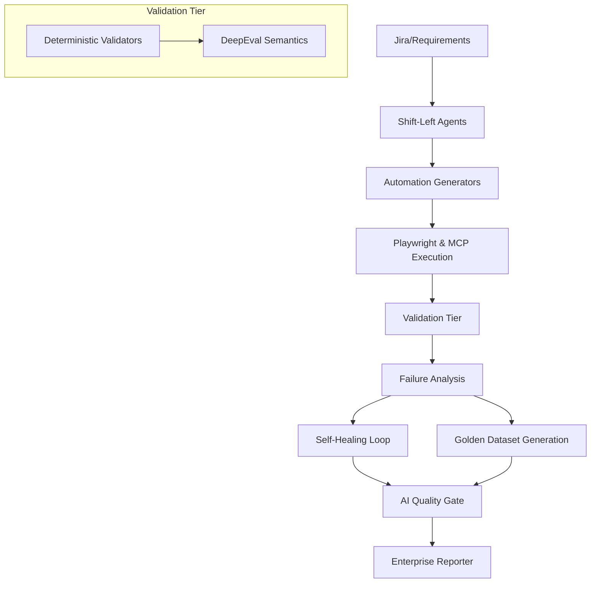

# NutriMind AI Quality Engineering Architecture

## 1. High-Level Design

The NutriMind AI QE framework is a hybrid Agentic Quality Engineering architecture. It combines the deterministic rigor of traditional software testing with the adaptive intelligence of Large Language Models (LLMs).

## 2. The Core Philosophy

### Where AI IS Used:
- **Test Design**: Deducing risks and edge cases from unstructured English requirements.
- **Root Cause Analysis (RCA)**: Parsing complex stack traces and DOM snapshots to find application defects.
- **Self-Healing**: Proposing Git patches for broken selectors or broken API payloads.
- **Semantic Evaluation**: Using `DeepEval` to determine if a conversational chatbot response is faithful to a context or hallucinates.

### Where AI is NOT Used:
- **Hard Business Rules**: AI is strictly forbidden from evaluating deterministic constraints. For example, verifying that a meal plan contains zero peanuts for an allergic user is done via standard Python assertion logic, not an LLM prompt.
- **CI/CD Go/No-Go**: The Quality Gate is governed by explicit configuration (e.g., `ai_hallucination_max = 5.0`). AI does not "decide" if a build is good enough; it only provides the metrics for the hard-coded gate.

## 3. Why Deterministic Validation is Required
LLMs are probabilistic. They suffer from "sycophancy" (agreeing with the user even when wrong) and hallucination. If we ask an LLM, *"Does this meal plan contain peanuts?"*, it might see "peanut butter" and mistakenly categorize it as safe. 

**Rule:** One agent's unvalidated output cannot become another agent's source of truth. Therefore, deterministic validators parse outputs using precise JSON schemas before any semantic (DeepEval) testing occurs.
