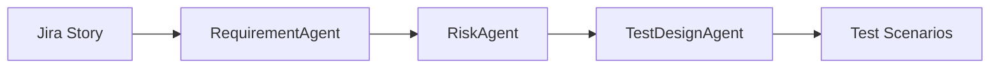

# Shift-Left Quality Strategy

In traditional software development, QA is often a bottleneck at the end of the delivery cycle. The NutriMind Framework uses AI to push quality checks to the very beginning of the SDLC.

## The Ingestion Phase
Before a developer writes a single line of application code, the `RequirementAgent` and `RiskAgent` ingest the raw Jira story.

These agents autonomously identify:
1. **Implicit Risks**: "If this meal plan is vegetarian, we must ensure hidden animal by-products like gelatin are explicitly excluded."
2. **Missing Criteria**: "The story mentions a calorie target, but doesn't specify the acceptable +/- variance range."

By generating formal Test Scenarios and mapping Traceability *before* development begins, the AI acts as an active participant in Agile grooming, preventing defects from ever being coded.
